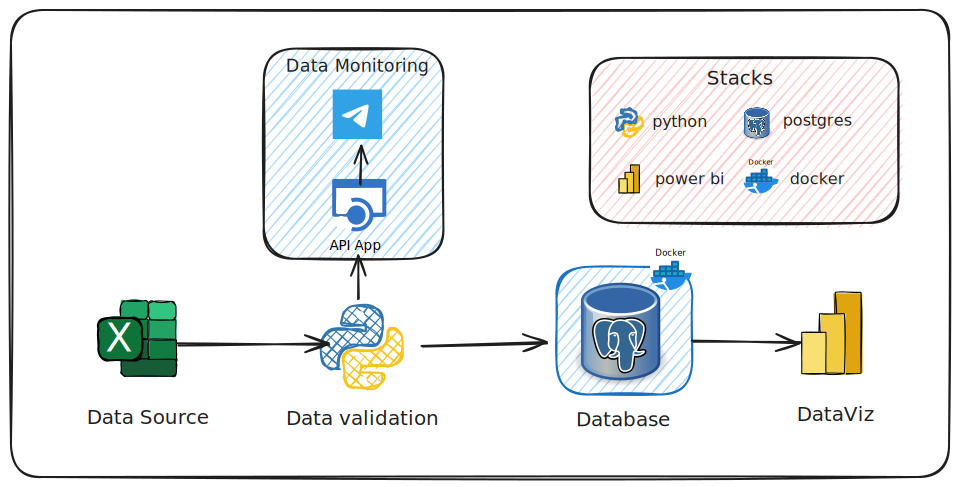

# Documentação do Projeto

# Objetivo

O objetivo deste projeto é fazer um script Python que valida o formato e a estrutura dos dados presentes em um arquivo Excel. Após essa validação, o script envia mensagens de monitoramento para o Telegram e, em seguida, insere os dados em um banco de dados PostgreSQL dockerizado, que possui versionamento gerenciado via a biblioteca Alembic do Python.



*Stack Utilizadas*

[Alembic 1.13.2](https://alembic.sqlalchemy.org/en/latest/index.html)

[Python 3.10.13](https://docs.python.org/3.10/)

[Docker](https://docs.docker.com/)

[Postgres 16.4](https://hub.docker.com/_/postgres)

[Power BI](https://learn.microsoft.com/pt-br/power-bi/)

## Holds Bot

Atraves deste projeto você terá acesso ao holds bot, um bot responsável por monitorirar cargas dentro banco de dados fornecendo principais informações de se os dados foram inseridos corretamente dentro banco de dados.  


## Estrutura do Projeto

O projeto é organizado em várias pastas e arquivos que ajudam a manter a separação de responsabilidades e a organização do código. Aqui está uma descrição de cada parte do projeto:

```bash
── data/
│   ├── # Arquivos de dados que serão processados pelo projeto
│   └── example_data.csv
├── linhas_erradas/
│   ├── # Arquivos contendo as linhas de dados que apresentaram erros durante o processamento
│   └── example_errors.csv
├── mappers/
│   ├── # Mapeamento de colunas ou transformações personalizadas
│   └── MapperSalesData.py
├── migrations/
│   ├── # Arquivos relacionados ao Alembic para migrações do banco de dados
│   └── versions/
├── models/
│   ├── # Definições das tabelas do banco de dados utilizando SQLAlchemy
│   └── model_base.py
├── modules/
│   ├── # Módulos principais do projeto, como conexão com banco, processamento de dados, etc.
│   ├── database_connection.py
│   ├── data_processor.py
│   ├── log.py
│   ├── monitoring.py
│   ├── telegram_notifier.py
├── utils/
│   ├── # Utilitários e funções auxiliares
│   └── custom_exceptions.py
├── .env
│   ├── # Variáveis de ambiente para configuração do projeto e banco de dados
│   ├── DB_HOST=localhost
│   ├── DB_PORT=5432
│   ├── DB_USER=postgres
│   ├── DB_PASSWORD=postgres
│   ├── DB_NAME=stage
│   ├── TELEGRAM_BOT_TOKEN=your_telegram_bot_token
│   ├── TELEGRAM_CHAT_ID=your_telegram_chat_id
│   └── DEBUG_MODE=True
├── docker-compose.yml
│   ├── # Arquivo para subir o banco de dados PostgreSQL utilizando Docker
├── init.sql
│   ├── # Script SQL para inicializar o banco de dados
├── main.py
│   ├── # Script principal do projeto em Python que executa o fluxo completo
└── requirements.txt
    ├── # Lista de dependências Python para o projeto
```

## Passo a Passo de Configuração e Execução

### 1. Configurando as Variáveis de Ambiente

Antes de iniciar qualquer coisa, é essencial que as variáveis de ambiente sejam configuradas corretamente. Isso inclui as credenciais de banco de dados, tokens de API, e outras configurações necessárias para o projeto.

No arquivo `.env`, você deve definir as seguintes variáveis, veja exemplo abaixo:

```env
DB_HOST=localhost
DB_PORT=5432
DB_USER=postgres
DB_PASSWORD=postgres
DB_NAME=stage
TELEGRAM_BOT_TOKEN=your-telegram-bot-token
TELEGRAM_CHAT_ID=your-telegram-chat-id
DEBUG_MODE=TRUE
```

Obs.: Neste projeto, utilizamos um grupo do telegram para monitoração. Acesse este [link](https://www.youtube.com/watch?v=_RQw5Nw7Op0)  aprender criar seu Telegram token.


### 2. Subindo o Banco de Dados com Docker

Depois de configurar as variáveis de ambiente, o próximo passo é iniciar o banco de dados usando Docker. Para isso, utilize o arquivo `docker-compose.yml`:

```bash
docker-compose up -d
```

Este comando fará o seguinte:

- Criará e iniciará um container Docker com o PostgreSQL utilizando as configurações especificadas no `docker-compose.yml`.
- Executará o script `init.sql` para configurar as tabelas iniciais e dados necessários.

*Obs.: O Banco de Dados se encontra no schema stage*

### 3. Instalando as Dependências do Projeto

Antes de executar o código Python, todas as dependências listadas no arquivo `requirements.txt` devem ser instaladas. Execute o seguinte comando:

```bash
pip install -r requirements.txt
```

### 4. Aplicando Migrações com Alembic

Com o banco de dados em execução, é necessário aplicar as migrações para criar as tabelas definidas nos modelos. Para isso, você deve usar o Alembic. Execute o comando abaixo para aplicar todas as migrações pendentes:

```bash
alembic upgrade head
```

Este comando fará o seguinte:

- Aplicará as migrações definidas na pasta `migrations/` e atualizará o banco de dados para a versão mais recente.

Isso instalará todas as bibliotecas e pacotes necessários para que o projeto Python funcione corretamente.

### 5. Executando o Projeto Python

Depois que todas as dependências estiverem instaladas e o banco de dados estiver em execução com as migrações aplicadas, você pode iniciar o projeto Python. O ponto de entrada do projeto é o arquivo `main.py`, localizado na raiz do projeto.

Execute o projeto com o seguinte comando:

```bash
python main.py
```

Isso iniciará o processamento de dados conforme definido no código Python.

## Considerações Finais

- **Versão Python**: Para utilizar esse projeto utilze versão `3.10` do `python`.

- **Migrações Alembic**: Para criar novas tabelas ou modificar as existentes, crie novas revisões com `alembic revision --autogenerate -m "your message"` e aplique as migrações com `alembic upgrade head`.

- **Dependências**: Para adicionar novas dependências, instale o pacote desejado e adicione-o ao `requirements.txt`.

# Direitos de Uso
***
Este repositório têm como objetivo apresentar um sistema de monitoramento via linguagem Python. Então, dentro deste repositório você pode utilizar deste conteúdo sem nenhuma restrição contanto que não me responsebilize por eventuais causas ou danos morais perante minha responsabilidade.	

Exigido | Permitido | Proibido
:---: | :---: | :---:
Aviso de licença e direitos autorais | Uso comercial | Responsabilidade Assegurada
 || Modificação ||	
 || Distribuição ||	
 || Sublicenciamento || 	